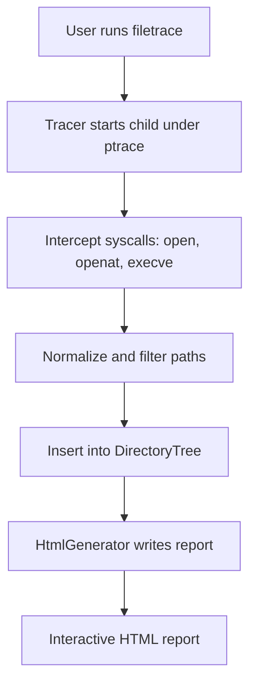

# FileTrace User Guide

This guide explains what FileTrace does, how to build and run it, how the output works, and how the codebase is organized.

## What is FileTrace?

FileTrace is a Linux tool that traces file access activity of a target command, including process/thread creation and file opens. It builds a thread-aware directory tree of accessed paths and generates an interactive HTML report that you can explore, filter, and search. The tracer uses ptrace to intercept syscalls and associate each access with the process or thread that made it.

Key capabilities:
- Tracks forks (fork, vfork) and thread/process creations (clone).
- Associates file open events with the specific thread/process performing them.
- Normalizes and filters paths for clarity and focus.
- Produces a searchable, collapsible, interactive HTML report.

## Requirements

- Linux operating system
- GCC 8+ or Clang 7+
- CMake 3.15+
- C++17

No special privileges are required to trace a child process that FileTrace launches (it uses PTRACE_TRACEME in the child). You do not need root for standard usage.

## Build and Install

You can build the project with CMake. Dependencies (cxxopts for CLI parsing and GoogleTest for tests) are fetched automatically.

Steps:
1. mkdir build
2. cd build
3. cmake ..
4. make

This will produce the executable:
- build/bin/filetrace

## Running FileTrace

Basic invocation:
- filetrace <command> [args...]

You can pass options to FileTrace before the command. To keep options for your command separate, you may also use the conventional double-dash separator:
- filetrace [options] -- <command> [args...]

Examples:
- filetrace ls -l
- filetrace --output-html trace.html gcc -c main.cpp
- filetrace -a make
- filetrace -d /path/to/dir ls
- filetrace -- ./script.sh

Notes:
- By default, FileTrace focuses on files within the current directory (filtering enabled), but allows certain system paths needed during execution (e.g., /lib, /proc, /etc/ld.so.cache).
- Use -a to disable directory filtering and show all files regardless of directory.
- Paths are normalized (including symlink resolution where possible) for consistency.

## Command-Line Options

FileTrace uses cxxopts for option parsing and supports:

- -o, --output-html <file>
  Specifies the HTML output file. Default: filetrace_output.html

- -a, --all
  Disables directory filtering and shows all recorded files.

- -d, --directory <path>
  Base directory for file filtering (default is the current working directory). When filtering is enabled, only files within this directory (plus specific allowed system paths) are included.

- -h, --help
  Prints help and usage.

- -v, --version
  Prints version information.

Positional:
- command
  The command to execute and trace, followed by its arguments.

Behavioral details:
- FileTrace records actual open operations (open, openat). It avoids counting execve lookups as file opens.
- For openat relative paths, FileTrace resolves the base directory from the dirfd to obtain a normalized absolute path when possible.

## Output

The generated HTML report provides:
- A directory-style view of accessed files, annotated with sequence numbers and thread/process info.
- Collapsible directories, hover/click interactions, and a search box to filter nodes by name.
- Dark-mode aware styling and subtle animations for better readability.
- Debug panel including the output file path for trace reproducibility.

You can open the HTML in any modern browser.

## How It Works (Architecture Overview)

Execution flow (high level):
1. The tool parses the CLI options (cxxopts) and validates the output path and target command.
2. It forks the target command under ptrace to intercept syscalls.
3. As the target runs, FileTrace tracks processes/threads as they are created (clone/fork/vfork) and marks their lifecycle.
4. On file-related syscalls (open/openat), it reads strings from the tracee’s memory and resolves/normalizes paths (including openat relative path handling).
5. Validated file open events are inserted into an in-memory DirectoryTree, attached to the responsible thread/process.
6. When tracing completes, HtmlGenerator produces the final interactive HTML report.

Mermaid overview:

Core components:
- main.cpp
  - CLI parsing, tracing loop, syscall interception, thread/process model, output path and command validation, HTML generation.
- path_utils.hpp
  - Path normalization and filtering logic, including symlink resolution and system path allowances.
- directory_tree.hpp
  - DirectoryTree and DirectoryNode that model accessed files in a hierarchical structure with sequence/thread metadata.
- html_generator.hpp
  - Writes a self-contained HTML report from the DirectoryTree with styles, scripts, and search interactions.
- logger.hpp
  - Simple, thread-safe logging utility with severity levels (TRACE/DEBUG/INFO/WARNING/ERROR).

For a deeper architectural description, diagrams, and inter-component relationships, see architecture.md in this same folder.

## Project Structure

High-level layout:
- CMakeLists.txt
  Top-level build configuration. Fetches cxxopts and GoogleTest.
- src/
  - main.cpp               Entry point and tracer orchestration.
  - path_utils.hpp         Path normalization and directory filtering utilities.
  - directory_tree.hpp     Directory tree model for file operations and HTML fragment generation.
  - html_generator.hpp     HTML report generator.
  - logger.hpp             Logging utility.
- tests/
  - CMakeLists.txt         Test build configuration.
  - test_process_hierarchy.cpp
  - test_thread_termination.cpp
  - test_file_monitoring.cpp
  - test_logger.cpp
- doc/demo.gif             Demonstration animation (if provided).
- kavia-docs/
  - architecture.md        Detailed architecture documentation.
  - user-guide.md          This file.

## Testing

The project uses GoogleTest and CTest.

Build and run tests:
1. mkdir build
2. cd build
3. cmake ..
4. make
5. ctest --output-on-failure

The tests cover:
- Process/Thread hierarchy modeling in DirectoryTree.
- Handling of thread termination patterns.
- File monitoring semantics (e.g., existing and symlinked files).
- Logger behavior (levels, formatting, thread safety).

## Troubleshooting

- Output file path invalid or unwritable:
  The tool validates the output path before tracing (directory must exist and be writable). Choose a valid path or directory and re-run.
- Command not found or not executable:
  The tool searches PATH if no path separator is given. Ensure the command exists or provide an absolute/relative path to the executable.
- No file entries in report:
  If you are filtering to a base directory, ensure the accessed files fall within the chosen directory or use -a to disable filtering. Some system paths are allowed by default even with filtering.
- Permissions:
  Standard usage does not require root because FileTrace traces its own child via PTRACE_TRACEME. If you attempt other modes (not provided here), you might need additional privileges.

## License

This project is licensed under the MIT License. See the LICENSE file for details.
